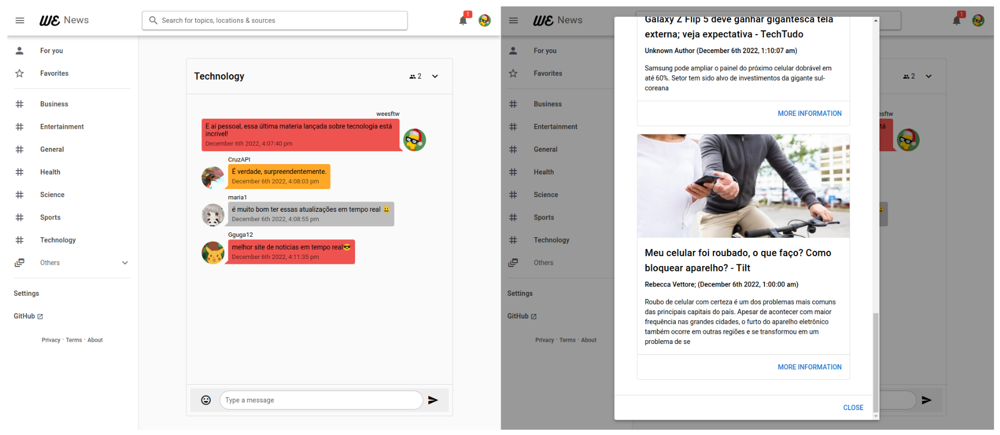

# wenews
Real-time news API - [wenews.cf](http://wenews.cf)

## About

Creation of an integrating web application that will use public news APIs to allow the engagement of conversations on various subjects in real time.

- Using [newsapi.org](http://newsapi.org) to map the news into the dev plan.

## Author
| [ @weesftw](https://github.com/weesftw) |
|:------------------------------------------------------------------------------------------------------------------:|

## Technology

- [Gradle](https://gradle.org/)
- [Micronaut](https://micronaut.io/)
- [MongoDB](https://www.mongodb.com/)
- [MySQL](https://www.mysql.com/)
- [Quasar](https://quasar.dev/)
- [RabbitMQ](https://www.rabbitmq.com/)
